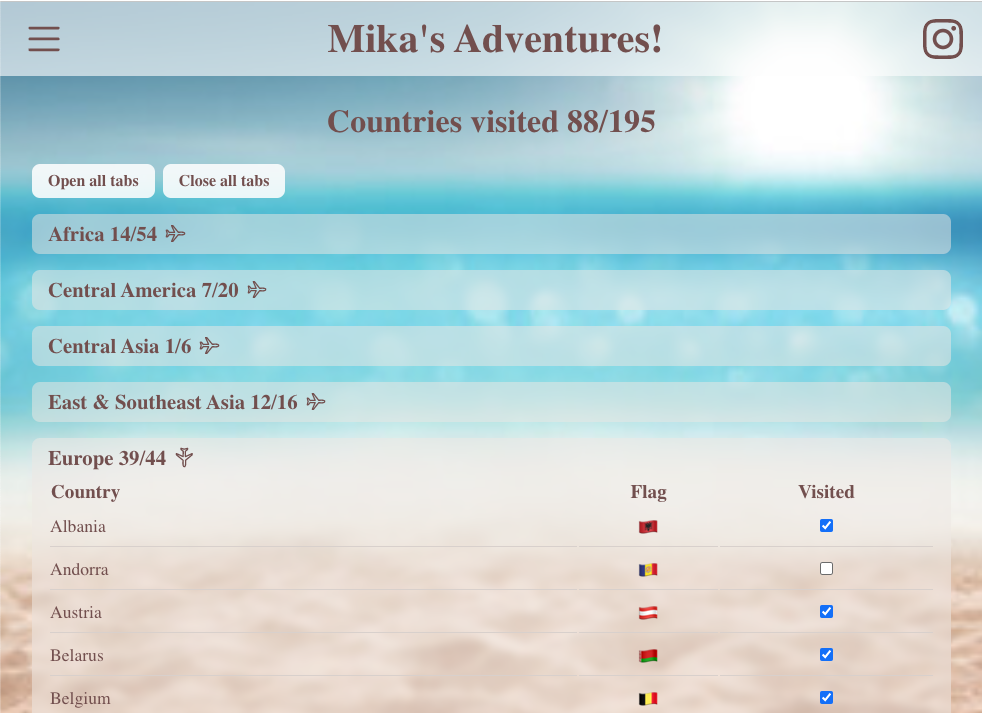
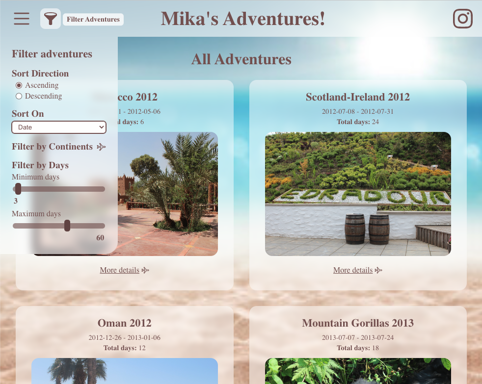
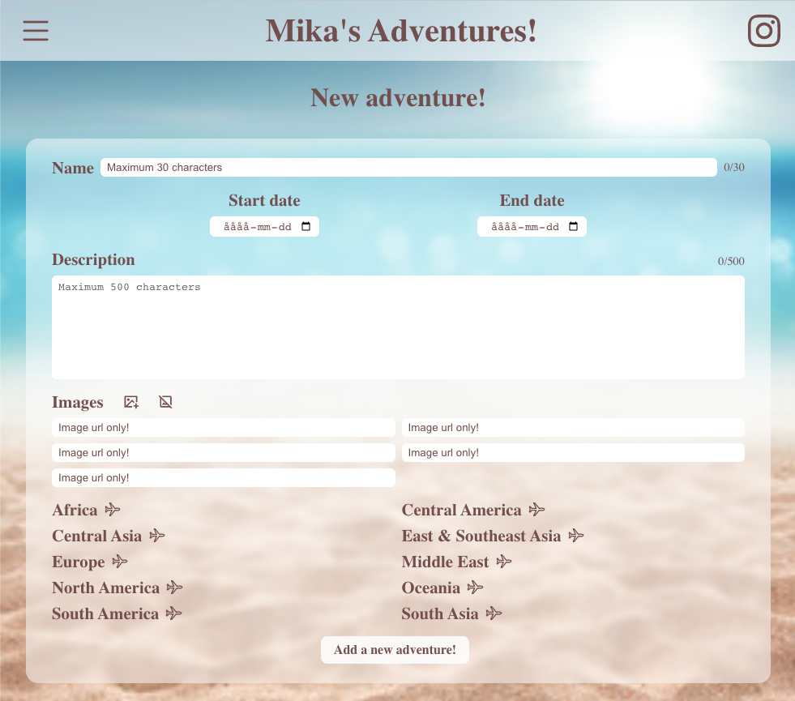
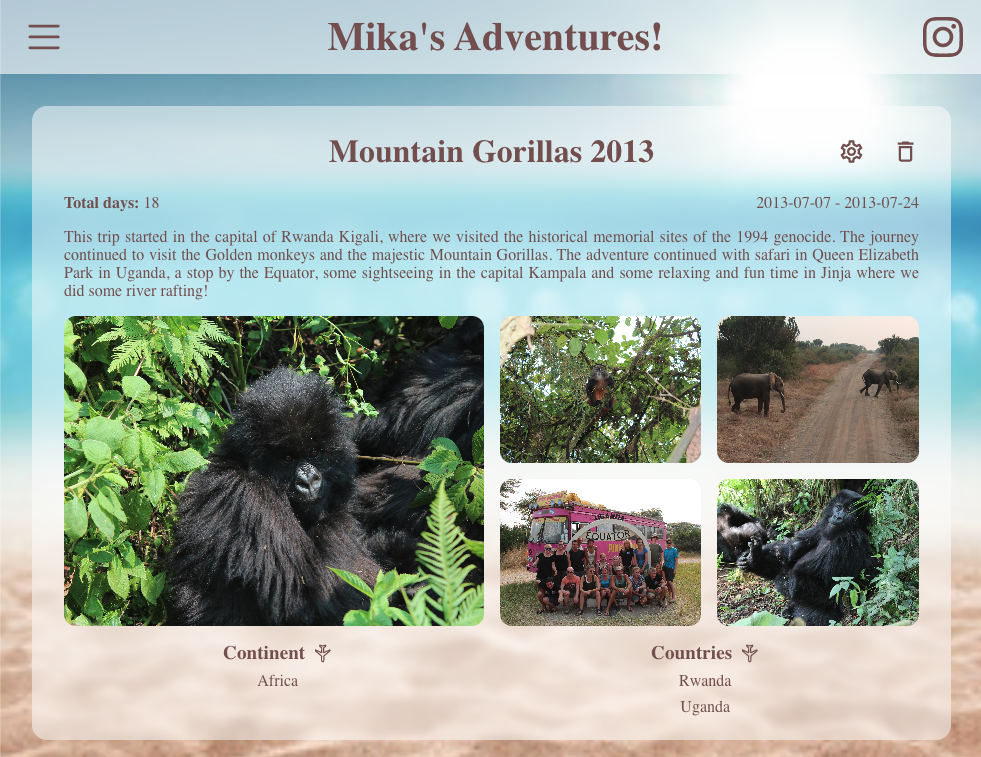

# **Adventures**

[Visit this project live](https://adventures-mikamunterud.vercel.app/)

This project is my final assignment in the course FrontEnd 3 JavaScript-libraries and frameworks.

## **Assignment Description**

The assignment is to build an application that lists data of an option type and where you can add new data to the application. This could be a list og users, restaurants, products or anything else.

### **Requirements for Approved (G)**

>* The application should be created with a framework such as React, Vue, Angular, Svelte, etc.
>* The application should have at least two routes.
>* One of the routes should have a form to add a new "unit". This should be saved in some type of data source, such as JSON server.
>* On the other route should all added "units" be listed.
>* The application must use some kind of styling library. This could be SASS, styled-components or any other UI library or a combination of them.

### **Requirements for Well Approved (VG)**

>* There should be a route where you can see a single "unit".
>* It should be possible to remove a unit either on the single-page unit or where all the units are listed.
>* On the route where all units are listed, it must be possible to filter which ones are visible. there should have the possibility to be filtered. This can be based on things like product category or user role or similar.
>* It should also be possible to choose different sorting on the listed units, for example by product name or price.

## **My project**

My homepage containing lists of continents and their countries was only an extra route I created that was not part of the assignment criteria.
For that reason the checkboxes works visually on the FrontEnd but has not yet been connected to the backEnd (JSON server) to be able to save the changes made.

The main assignment page where all my adventures are listed can be filtered based on continents or total number of days the adventures are. They can also be sorted based on date, days or name in ascending or descending order.

The page to add a new adventure have all the inputs fields that a listed adventure have. However since an adventure can only by added when using JSON server, only image urls are accepted. Also a new adventure cannot be added if another adventure have the same starting date.

On the single adventure page, all details of the adventure is shown and it is also possible to delete or edit the adventure if JSON server is used.

